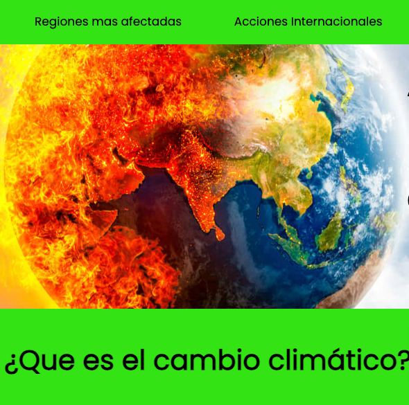

# Climate change web design

## Technologies used:
- HTML
- CSS
- JAVASCRIPT

## Description:
Design and development of an informative website on climate change, with relevant data and an interactive experience. The site is completely responsive, adapting to resolutions from 360px to 1920px. It includes a hangman-type game with questions about climate change, three difficulty levels, and background music to enhance the user experience.

## How to use:
<ol>
    <li>Download the project in any way you choose.</li>
    <li>Open it with your favorite code editor.</li>
    <li>Open a terminal.</li>
    <li>Install the dependencies you need.</li>
    <li>Run the following command in your terminal: npm run dev.</li>
    <li>Copy the link it provides you into your browser bar.</li>
    <li>Enjoy!</li>
</ol>

## Contribution:
If you have any suggestions or problems, don't hesitate to let me know! Thank you!! 